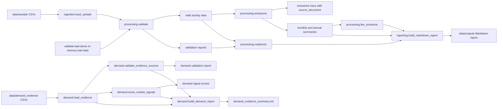

# Architecture

CarbonRadar SME v0.2 is a local batch pipeline. It uses committed CSV files as the data source, pandas dataframes for processing, pydantic models for typed output records, and Markdown files for reports.

## Components

- `carbonradar.ingestion`: loads deterministic sample CSVs.
- `carbonradar.processing.validate`: normalizes month fields and returns valid rows plus validation issues.
- `carbonradar.processing.emissions`: calculates Scope 1 and Scope 2 emissions and preserves calculation traces.
- `carbonradar.processing.fee_scenarios`: estimates Taiwan carbon-fee exposure using v0.1 scenario assumptions.
- `carbonradar.processing.readiness`: scores supplier disclosure readiness.
- `carbonradar.reporting`: builds organization-year Markdown reports.
- `carbonradar.demand`: loads curated public demand evidence, validates sources, scores market signals, and builds the demand evidence report.
- `carbonradar.cli`: exposes the reproducible command line workflow.

## Flow

```text
data/sample/*.csv
  -> load_sample_data()
  -> validate_all()
  -> calculate_emissions()
  -> fee_scenario_frame()
  -> score_readiness()
  -> build_markdown_report()
  -> data/outputs/*
```



No frontend, OCR, live scraping, live API connection, message queue, workflow scheduler, or deployment platform is part of v0.2.
