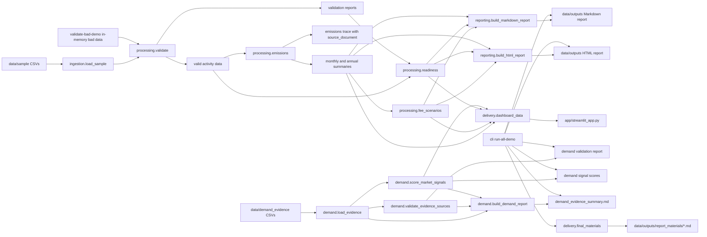

# Architecture

CarbonRadar SME v0.3.2 is a local batch pipeline with a small local delivery layer. It uses committed CSV files as the data source, pandas dataframes for processing, pydantic models for typed output records, Markdown/HTML files for reports, Streamlit for a demo dashboard, generated source materials for the final report, and minimal Streamlit Community Cloud deployment files.

## Components

- `carbonradar.ingestion`: loads deterministic sample CSVs.
- `carbonradar.processing.validate`: normalizes month fields and returns valid rows plus validation issues.
- `carbonradar.processing.emissions`: calculates Scope 1 and Scope 2 emissions and preserves calculation traces.
- `carbonradar.processing.fee_scenarios`: estimates Taiwan carbon-fee exposure using a simplified K-value chargeable-emissions model.
- `carbonradar.processing.readiness`: scores supplier disclosure readiness.
- `carbonradar.reporting`: builds organization-year Markdown reports.
- `carbonradar.reporting.build_html_report`: builds standalone PDF-ready HTML reports.
- `carbonradar.demand`: loads curated public demand evidence, validates sources, scores market signals, and builds the demand evidence report.
- `carbonradar.delivery`: prepares reusable dashboard data, the one-command demo bundle, and final report source materials.
- `app.streamlit_app`: local Streamlit dashboard for the final project delivery layer.
- `carbonradar.cli`: exposes the reproducible command line workflow.

## Flow

```text
data/sample/*.csv
  -> load_sample_data()
  -> validate_all()
  -> calculate_emissions()
  -> fee_scenario_frame()
  -> score_readiness()
  -> build_markdown_report()
  -> data/outputs/*
```



No authentication, OCR, live scraping, live API connection, database, message queue, workflow scheduler, or custom deployment platform is part of v0.3.2.

## Mapping To Final Project Requirements

- Ingestion: committed CSV inputs for factory master, utility bills, fuel logs, supplier disclosures, emission factors, and curated demand evidence.
- Processing: validation, month normalization, emissions calculation, simplified K-value carbon-fee scenarios, readiness scoring, and demand public-data support scoring.
- Delivery: CLI outputs, Markdown report, standalone HTML report, Streamlit dashboard, and final report source materials.
- Demand evidence: curated public evidence tables with source metadata, confidence labels, validation reports, score CSV, and Markdown digest.
- Business value: helps SME manufacturers organize carbon data, identify gaps, preserve traceability, and prepare for consultant or customer disclosure workflows.
- Limitations: demo data, placeholder fuel factors, no full Scope 3, no product LCA, no OCR, no live APIs, no scraping, no database, no authentication, and no legal or certification interpretation.
